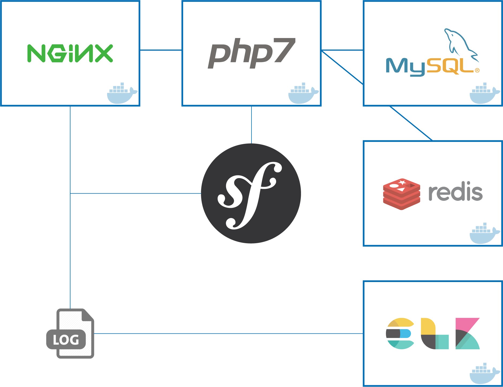

# Full Docker for Symfony 3

[](LICENSE)
[](https://github.com/carlosas/full-docker-for-symfony-3/issues)



**NOTE:** This complete stack run with docker and [docker-compose](https://docs.docker.com/compose/).

## Installation

1. Create a `.env` from the `.env.dist` file and adapt it according to your symfony application

    ```sh
    $ cp .env.dist .env && nano .env
    ```

2. Build/run containers in detached mode

    ```sh
    $ docker-compose build
    $ docker-compose up -d
    ```

3. Update your system hosts file

    ```sh
    # Get bridge IP address and update hosts file
    $ sudo echo $(docker network inspect bridge | grep Gateway | grep -o -E '[0-9\.]+') "symfony.dev" >> /etc/hosts
    ```

4. Prepare your Symfony app
    1. Update Symfony parameters (*app/config/parameters.yml*)

        ```yml
        parameters:
            database_host: db
            #...
            redis_host: redis
        ```

    2. Composer install & create database

        ```sh
        $ docker-compose exec php bash
        $ composer install
        $ symfony doctrine:database:create
        $ symfony doctrine:schema:update --force
        ```
5. (Optional) Xdebug: Configure your IDE to connect to port `9001` with key `PHPSTORM`

## How does it work?

We have the following *docker-compose* built images:

* `nginx`: This is the Nginx webserver container in which application volume is mounted.
* `php`: This is the PHP-FPM container in which the application volume is mounted too.
* `db`: This is the MySQL database container.
* `elk`: Container which uses Logstash to collect logs, send them into Elasticsearch and visualize them with Kibana.
* `redis`: This is the Redis service container.

Running `docker-compose ps` should result in the following running containers:

```
           Name                          Command               State              Ports
--------------------------------------------------------------------------------------------------
dockers_db_1            /entrypoint.sh mysqld            Up      0.0.0.0:3306->3306/tcp
dockers_elk_1           /usr/bin/supervisord -n -c ...   Up      0.0.0.0:81->80/tcp
dockers_nginx_1         nginx                            Up      443/tcp, 0.0.0.0:80->80/tcp
dockers_php_1           php-fpm                          Up      0.0.0.0:9000->9000/tcp
dockers_redis_1         docker-entrypoint.sh redis ...   Up      6379/tcp
```

## Usage

Once all the containers are up, our services are available at:

* Symfony app: [symfony.dev](http://symfony.dev)
* Kibana: [symfony.dev:81](http://symfony.dev:81)
* Log files location: *logs/nginx* and *logs/symfony*

---

## Useful commands

```sh
# Docker commands
$ docker stats $(docker inspect -f "{{ .Name }}" $(docker ps -q)) # Check CPU consumption
$ docker stop $(docker ps -aq) # Stop all containers
$ docker rm $(docker ps -aq) # Delete all containers
$ docker rmi $(docker images -q) # Delete all images

# PHP commands
$ docker-compose exec php bash # Enter PHP bash
$ symfony cache:clear # Clear Symfony's cache
$ sudo chmod -R 777 var/cache var/logs var/sessions # Set cache/logs/sessions permissions

# MySQL commands
$ docker-compose exec db mysql --version # Check MySQL version
$ docker-compose exec db mysql -u root -p # Connect to MySQL command line

# Retrieve an IP Address (here for the nginx container)
$ docker inspect --format '{{ .NetworkSettings.Networks.dockersymfony_default.IPAddress }}' $(docker ps -f name=nginx -q)
$ docker inspect $(docker ps -f name=nginx -q) | grep IPAddress | grep -o -E '[0-9\.]+'
```
